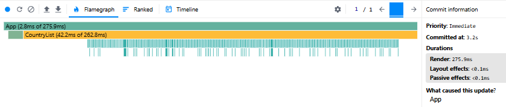
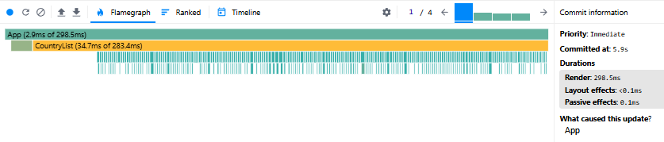
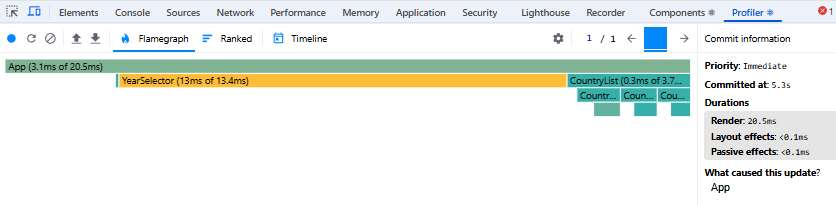
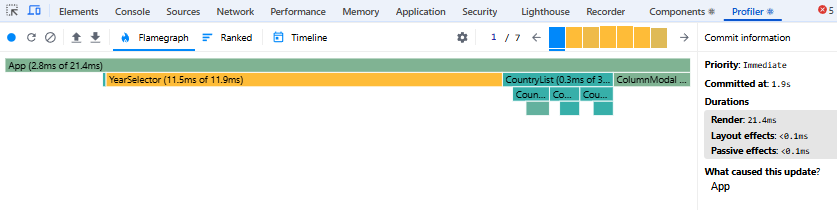

# Performance Optimization Report

## Baseline Measurements

### Interaction A: Sort countries

- **Commit duration**: 3.2 s
- **Render duration**: 275.9 ms
- **Screenshot**: 

### Interaction B: Search countries

- **Commit duration**: 5.9 s
- **Render duration**: 298.5 ms
- **Screenshot**: 

### Interaction C: Change year

- **Commit duration**: 5.3 s
- **Render duration**: 20.5 ms
- **Screenshot**: 

### Interaction D: Toggle column

- **Commit duration**: 1.9 s
- **Render duration**: 21.4 ms
- **Screenshot**: 

## Summary of Improvements

| Interaction      | Baseline (ms) | Optimized (ms) | Improvement |
| ---------------- | ------------- | -------------- | ----------- |
| Sort countries   | 275.9         | 18.3           | 93.37%      |
| Search countries | 298.5         | 16.8           | 94.37%      |
| Change year      | 20.5          | 37             | -80.49%     |
| Toggle column    | 21.4          | 19.3           | 9.81%       |
| **Average**      | **154.075**   | **22.85**      | **85.17%**  |